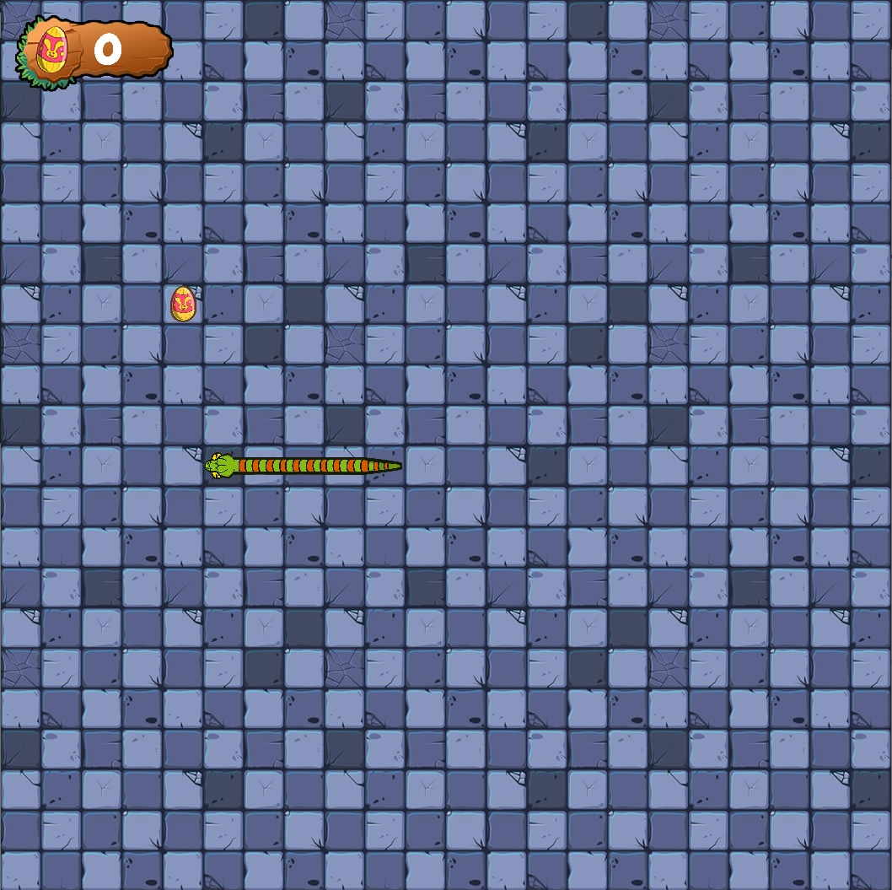

## General info
A small and simple miniature snake game in C++. This project was more of a practice in C++ in the GameDev realm. You shouldn't treat it as a full-fledged project and criticize it for that.  
However, you can take this code as a basis for your game. There are comments next to all the important things to help you learn the code.

In the game you have to eat Easter eggs. Also in the game there are 3 skins that change with a certain number of collected eggs. The egg counter is in the upper left corner.

	
## Additional libraries
Project is created with:
* Simple DirectMedia Layer (SDL) version: 2.0
	
## Setup
You can quickly run this project with **Snake.exe** on Windows.
Or you can build it yourself with:
* Visual Studio -> **Snake.vcxproj** 
* Cmake.  

However, to build it you need to load the **[SDL2 library](https://www.libsdl.org/)** 
